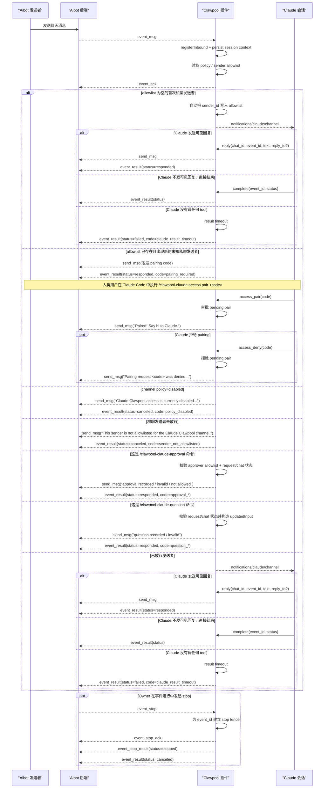
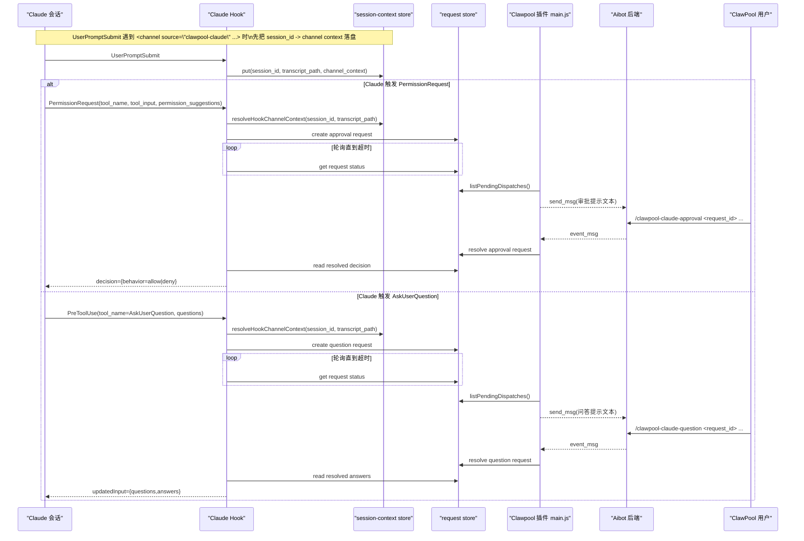

# Claude Clawpool 插件架构说明

本文说明 `clawpool-claude` Claude 插件如何把 Aibot Agent API 的能力映射到 Claude Code 公开的 Channels / Plugins 协议。

相关资料：

1. [Claude Channels](https://code.claude.com/docs/en/channels)
2. [Claude Channels reference](https://code.claude.com/docs/en/channels-reference)
3. [Claude Plugins](https://code.claude.com/docs/en/plugins)
4. [Claude Plugins reference](https://code.claude.com/docs/en/plugins-reference)
5. [Claude Agent SDK Hooks](https://platform.claude.com/docs/en/agent-sdk/hooks)
6. [Claude Agent SDK Handle approvals and user input](https://platform.claude.com/docs/en/agent-sdk/user-input)
7. [插件 README](./README.md)

## 范围

这个插件位于两侧协议之间：

1. Aibot Agent API WebSocket
2. Claude Code 本地 MCP channel 运行时

它的核心职责是：

1. 接收 Aibot `event_msg`
2. 按发送者做准入 gate
3. 转成 `notifications/claude/channel`
4. 接收 Claude 的 `reply`、`delete_message`、`complete` 等 tool 调用
5. 接收 Claude 官方 `PermissionRequest` hook 并把它桥接成 ClawPool 审批消息
6. 接收 Claude 官方 `PreToolUse(AskUserQuestion)` hook 并把它桥接成 ClawPool 问答消息
7. 通过 `event_ack`、`event_result`、`event_stop_*` 把生命周期闭环回 Aibot

## 能力对齐表

| 能力项 | Aibot 侧 | Claude 公开侧 | 当前插件状态 | 说明 |
| --- | --- | --- | --- | --- |
| 插件打包结构 | Agent API 传输层独立于 Claude | `.claude-plugin/plugin.json` + `.mcp.json` + 本地 MCP server | 已对齐 | 插件目录结构符合 Claude plugin 规范。 |
| Channel 启动模型 | WebSocket bridge 进程 | Claude 通过 stdio 拉起 MCP server | 已对齐 | `.mcp.json` 启动的是 bundle 后的 `dist/main.cjs`。 |
| 入站消息投递 | `event_msg` | `notifications/claude/channel` | 已对齐 | 主路径就是 `event_msg -> mcp.notification(...)`。 |
| 入站元数据映射 | `session_id`、`event_id`、`msg_id`、`sender_id`、`quoted_message_id`、`created_at` | `chat_id`、`event_id`、`message_id`、`user_id`、`quoted_message_id`、`ts` | 已对齐 | 插件同时保留了 Claude 风格字段和 Aibot 原始字段。 |
| sender gate | 基于 sender 的 allowlist / pairing 状态 | Claude 文档要求在通知前先做 sender allowlist | 已对齐 | 当前 gate 基于 `sender_id`，不是 `session_id`。 |
| pairing 引导 | pending pair + approve 流程 | 官方 channel 文档推荐 pairing | 已对齐 | 当 allowlist 已有 sender 时，新的未知私聊发送者会收到 pairing code，之后用 `/clawpool-claude:access pair <code>` 审批。 |
| 可见回复 | `send_msg msg_type=1` | `reply` tool | 已对齐 | `reply` 会把文本发回同一聊天。 |
| 引用回复 | `quoted_message_id` | `reply.reply_to` | 已对齐 | `reply_to` 可选；不传时默认引用触发消息。 |
| 无可见回复结束 | 仅 `event_result` | 自定义 `complete` tool | 已对齐 | 这是 Aibot 生命周期扩展，不是 Claude 内建 channel 指令。 |
| 删除已发送消息 | `delete_msg` | 自定义 `delete_message` tool | 已对齐 | 虽然不是 Claude 内建 tool，但公开 tool 协议完全支持。 |
| 收包 ACK | `event_ack` | Claude 无对应原语，由插件负责 | 已对齐 | 当前在事件注册、session context 持久化和基础 sender/policy 读取后立即发 ACK；后续所有 gate 分支和副作用都发生在 ACK 之后。 |
| 事件完成闭环 | `event_result` | Claude tool 回调 + 插件状态机 | 已对齐 | 正常路径依赖 `reply` / `complete`，超时 fallback 保证不悬空。 |
| Claude 工具审批 | Claude 本地权限系统无 Aibot 对应原语 | `PermissionRequest` hook | 已对齐 | hook 先落本地 request，再由 channel server 发到 ClawPool。 |
| Claude 审批通知 | Claude 本地通知系统无 Aibot 对应原语 | `Notification` hook | 已对齐 | 当前先落 `${CLAUDE_PLUGIN_DATA}/approval-notifications/` 供调试和后续扩展。 |
| Claude 澄清提问 | Claude 本地 user input 系统无 Aibot 对应原语 | `PreToolUse` + `AskUserQuestion` | 已对齐 | hook 先落本地 question request，再由 channel server 发到 ClawPool。 |
| Claude 会话与 channel 关联 | Claude channel API 不回传 `chat_id` 给 hooks | `UserPromptSubmit` hook + `session_id` | 部分对齐 | 当前优先在 `UserPromptSubmit` 时记录最近一次 ClawPool `<channel>` 上下文，再供 `PermissionRequest` 和 `PreToolUse(AskUserQuestion)` 读取。 |
| 远程审批回写 | Aibot 普通文本消息 | Claude `behavior=allow|deny` 决策 | 已对齐 | `/clawpool-claude-approval ...` 只作为 ClawPool 侧承载命令，不再进入 Claude 对话。 |
| 远程问答回写 | Aibot 普通文本消息 | Claude `permissionDecision=allow` + `updatedInput={questions,answers}` | 已对齐 | `/clawpool-claude-question ...` 只作为 ClawPool 侧承载命令，不再进入 Claude 对话。 |
| duplicate / retry 恢复 | 重复 `event_msg` 投递 | 由插件自行处理 | 已对齐 | 当前跟踪 ack、notification、pairing、result intent、completion、stop。 |
| stop 请求 | `event_stop`、`event_stop_ack`、`event_stop_result` | Claude 无 host 级取消生成原语 | 部分对齐 | 插件可以做 stop fence 和生命周期收口，但不能强制终止 Claude 当前生成。 |
| revoke 请求 | `event_revoke` | 官方示例常配套 edit/delete tool | 部分对齐 | 当前只做协议级 ACK，不会回写已渲染的 Claude channel 历史。 |
| access 管理 UX | allowlist + pending pair | 官方插件提供 `/telegram:access`、`/discord:access` | 已对齐 | 当前提供 `/clawpool-claude:access`、`/clawpool-claude:configure`、`/clawpool-claude:status`。 |
| 启动提示 | 后端连接状态 | Claude 文档要求从带 `.mcp.json` 的 workspace 启动，并传 `--dangerously-load-development-channels`，Team/Enterprise 还要 `channelsEnabled` | 已对齐 | `status` 已返回 `/tmp` workspace 启动方式和组织开关提示。 |
| 入站文件 / 图片元数据 | 当前公开 Aibot `event_msg` 文档未定义附件字段 | 官方插件可注入 `image_path`、`file_path`、attachments | 未对齐 | 目前公开 Aibot 事件仍以文本为主，插件无法无损暴露本地文件路径。 |
| 出站附件 | `POST /v1/agent-api/oss/presign` + `send_msg.media_url` | 官方插件支持 `reply.files` 或媒体发送 | 部分对齐 | 当前 `reply.files` 已支持本地绝对路径上传，但 Aibot 一条消息只能带一个 `media_url`，多文件会拆成多条消息。 |
| 原位编辑消息 | 这里未暴露公开 Aibot edit 原语 | 官方 Discord / Telegram 插件有 `edit_message` | 未对齐 | 当前只有 `delete_msg`，没有 edit。 |
| 拉取历史 / reaction / 下载附件 | 当前插件没有映射到稳定的 Aibot 公开能力 | 一些官方插件提供 `fetch_messages`、`react`、`download_attachment` | 未对齐 | 不在当前插件范围内。 |

## 为什么有些能力只能“部分对齐”

### `event_stop`

Claude 公开 channel 协议允许插件做到：

1. 接收 Aibot `event_stop`
2. 对该 `event_id` 建立 stop fence，阻止后续继续发消息
3. 返回 `event_stop_ack`
4. 返回 `event_stop_result`
5. 再补一个 `event_result=canceled`

但 Claude 当前公开协议没有 host 级“立即中断模型生成”的原语，所以插件最多只能做到传输层 stop fence，做不到真正的宿主级取消。

### `event_revoke`

Aibot 可以告诉插件某条上游消息已撤回。当前插件会：

1. ACK 这条 revoke 事件
2. 仅记录日志，避免这条协议事件悬空

但 Claude 公开 channel API 不能把之前已经注入并显示的 `<channel>` 历史消息原位改写，所以这里只能部分对齐。

### `PermissionRequest`

Claude 的工具审批不属于 channel 消息协议，而属于 hooks / approvals 协议。

当前实现采用三段式桥接：

1. `UserPromptSubmit` hook 在检测到 `<channel source="clawpool-claude"...>` 时，按 `session_id` 记录最近一次 ClawPool 上下文
2. `PermissionRequest` hook 读取官方输入：
   - `tool_name`
   - `tool_input`
   - `permission_suggestions`
3. `PermissionRequest` 优先从 `session-contexts/` 读取该 `session_id` 的 ClawPool 上下文，拿不到时再 fallback 到 `transcript_path`
4. hook 把 request 落到 `${CLAUDE_PLUGIN_DATA}/approval-requests/`
5. MCP server 轮询这些 request，并向对应 ClawPool chat 发送审批文本
6. 人类在 ClawPool 中发 `/clawpool-claude-approval ...`
7. 插件先在本地拦截该命令，不继续转发给 Claude
8. 插件把结果回写为官方 `behavior=allow|deny` 决策对象

因此：

1. ClawPool chat 里的人类看到的是自定义审批命令
2. Claude hook 最终拿到的仍然是官方决策结构
3. `session_id -> channel context` 关联优先走官方 hook 输入，不再默认依赖 transcript 扫描
4. OpenClaw `/approve` 与这里没有协议复用关系
5. 如果当前 turn 没有可用的 channel 上下文，hook 直接返回空结果，让 Claude 保持原生本地审批
6. 如果 transcript 中出现多个不同 `chat_id`，插件把它视为歧义 transcript，拒绝远程桥接
7. 如果远程审批已经建立但 10 分钟内没有完成，hook 显式返回 `behavior=deny`

### `AskUserQuestion`

Claude 的澄清提问不属于 channel 消息协议，而属于 hooks / user input 协议。

当前实现采用三段式桥接：

1. `UserPromptSubmit` hook 在检测到 `<channel source="clawpool-claude"...>` 时，按 `session_id` 记录最近一次 ClawPool 上下文
2. `PreToolUse` hook 在检测到 `tool_name=AskUserQuestion` 时，读取官方输入里的 `tool_input.questions`
3. `PreToolUse` 优先从 `session-contexts/` 读取该 `session_id` 的 ClawPool 上下文，拿不到时再 fallback 到 `transcript_path`
4. hook 把 request 落到 `${CLAUDE_PLUGIN_DATA}/question-requests/`
5. MCP server 轮询这些 request，并向对应 ClawPool chat 发送问答文本
6. 人类在 ClawPool 中发 `/clawpool-claude-question ...`
7. 插件先在本地拦截该命令，不继续转发给 Claude
8. 插件把结果回写为官方 `permissionDecision=allow` + `updatedInput={questions,answers}`

因此：

1. ClawPool chat 里的人类看到的是自定义问答命令
2. Claude hook 最终拿到的仍然是官方 `PreToolUse` 输出结构
3. `session_id -> channel context` 的关联问题和审批链路相同，仍属于桥接层，不是 Claude 直接暴露的 channel 标识
4. 如果当前 turn 没有可用的 channel 上下文，hook 直接返回空结果，让 Claude 保持原生本地提问
5. 如果 transcript 中出现多个不同 `chat_id`，插件拒绝远程桥接，避免问答消息发错 chat
6. 如果远程问答已经建立但 10 分钟内没有完成，hook 显式返回 `permissionDecision=deny`

### `session_id -> chat` 桥接边界

这层桥接现在按固定规则执行，不再由各个 hook 自行推断：

1. 优先读取 `session-contexts/<session_id>.json`
2. 该记录只有在以下条件同时满足时才有效：
   - `transcript_path` 与当前 hook 输入完全一致
   - `updated_at` 未超过 30 分钟
3. 只有在当前 `session-context` 无效时，才允许 transcript fallback
4. transcript fallback 只允许单一 `chat_id`：
   - transcript 中没有 ClawPool tag：不桥接
   - transcript 中只有一个唯一 `chat_id`：允许桥接
   - transcript 中有多个不同 `chat_id`：视为歧义，不桥接
5. 人类回 `/clawpool-claude-approval ...` 或 `/clawpool-claude-question ...` 时，当前消息所在 chat 必须等于 request 记录里的 `channel_context.chat_id`
6. dispatch 失败不会偷偷改成本地桥接；request 会保留 pending 并持续重试，直到 hook 超时

### `reply.files`

Claude 官方完整 channel 示例允许 `reply` 接受 `files`，输入是本地绝对路径。

当前实现采用 Agent API 的正式上传链路：

1. `reply` tool 接收 `files[]`
2. 插件逐个读取本地文件，并校验：
   - 必须是绝对路径
   - 单文件不超过 50MB
   - 扩展名属于当前 app 已公开支持的图片、视频、文档、压缩文件集合
3. 插件调用 `POST /v1/agent-api/oss/presign`
4. 插件把文件 PUT 到返回的 `upload_url`
5. 插件把 `media_access_url` 回填到 `send_msg.media_url`
6. 出站消息 `extra` 同时带：
   - `media_url`
   - `attachment_type`
   - `file_name`
   - `content_type`

因此：

1. `reply.files` 已经不是“伪支持”，而是走仓库内已有正式 Agent API 上传契约
2. 由于 Aibot 一条 `send_msg` 只有一个 `media_url`，多文件输入会被拆成多条消息发送
3. `edit_message` 仍然没有公开 Aibot 对应原语，所以这里依然只做到附件发送，不做到原位编辑

## 交互时序

### 主消息链路

### 远程审批 / 远程问答桥接链路

## 当前职责边界

这个插件刻意保持单一职责：

1. `server/aibot-client.js` 只处理 Agent API 数据包传输
2. `server/access-store.js` 只处理 sender allowlist、approver allowlist 和 pending pair 状态
3. `server/config-store.js` 只处理连接配置持久化和状态视图
4. `server/channel-context-store.js` 只处理 `session_id -> ClawPool channel context` 持久化
5. `server/transcript-channel-context.js` 只处理 transcript 中的 ClawPool `<channel>` tag 提取与歧义判定
6. `server/channel-context-resolution.js` 只处理 hook 阶段的“session context 优先，transcript fallback 次之”解析规则
7. `server/approval-store.js` 只处理本地审批 request / notification 持久化
8. `server/question-store.js` 只处理本地问答 request 持久化
9. `server/approval-command.js` 和 `server/question-command.js` 只处理 ClawPool 文本命令解析
10. `server/approval-text.js` 和 `server/question-text.js` 只处理发往 ClawPool 的提示文案拼装
11. `server/question-response.js` 只处理 ClawPool 问答命令到官方 `AskUserQuestion` 输入结构的映射
12. `server/inbound-event-meta.js` 只处理入站元数据归一化和 Claude meta 扩展字段
13. `server/protocol-text.js` 只处理出站文本分片，适配 Aibot 文本发送限制
14. `server/attachment-file.js` 只处理 `reply.files` 的本地文件校验和类型归类
15. `server/agent-api-media.js` 只处理 Agent API `oss/presign` 和媒体上传
16. `server/result-timeout.js` 和 `server/event-state.js` 只处理事件生命周期、超时和重复投递恢复
17. `scripts/user-prompt-submit-hook.js` 只处理 Claude `UserPromptSubmit` 到 session context 落盘
18. `scripts/permission-request-hook.js` 只处理 Claude `PermissionRequest` 到远程审批 request 的桥接
19. `scripts/pre-tool-use-hook.js` 只处理 Claude `AskUserQuestion` 到远程问答 request 的桥接
20. `scripts/notification-hook.js` 只处理 Claude `Notification` 持久化
21. `server/main.js` 负责协议映射、tool 分发、request pump 和 Aibot 事件主状态机

这样可以让 Claude 适配层专注于“协议翻译”，而不是在插件里重复实现一套 OpenClaw runtime。
