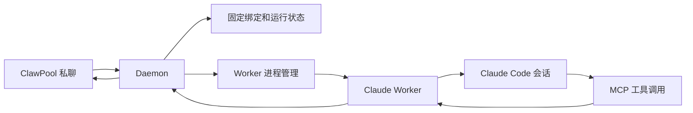
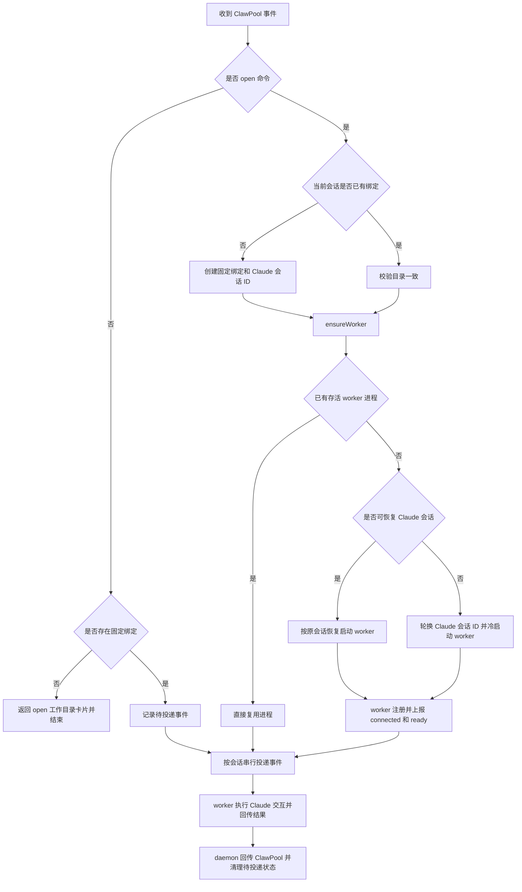
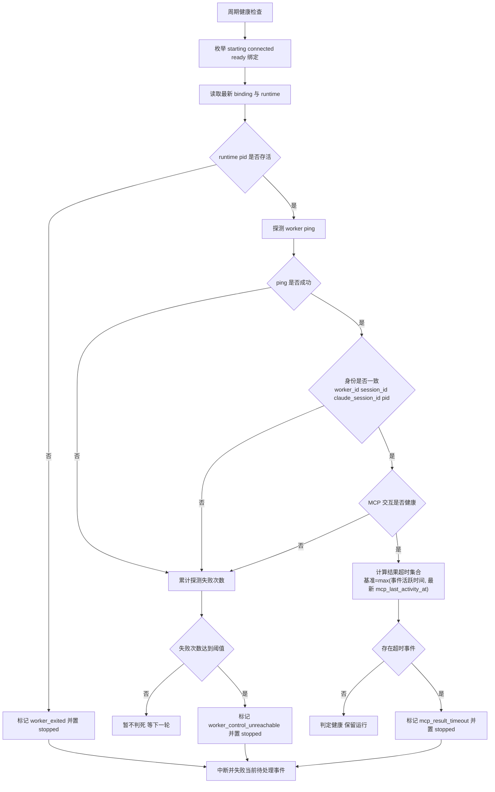
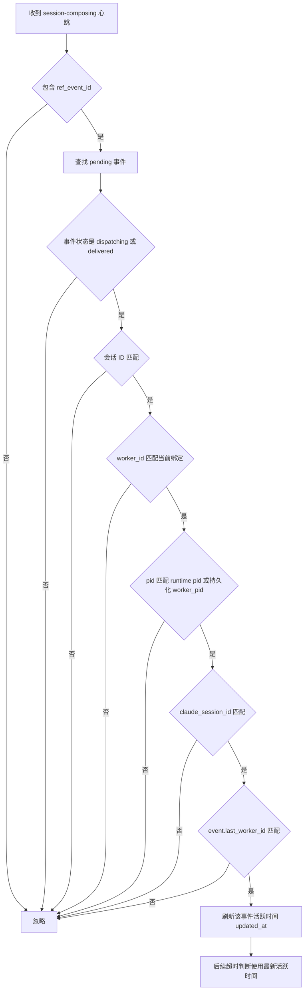

# ClawPool Claude 工作方式

`clawpool-claude` 做三件事：

1. 接收 ClawPool 发来的消息
2. 把消息送进 Claude Code
3. 把 Claude 的回复、审批请求、追问再发回 ClawPool

## 系统总览图



## 用户启动链路

正式使用推荐先安装后台服务：

```bash
clawpool-claude install --ws-url <ws_url> --agent-id <agent_id> --api-key <api_key>
```

这一步会自动：

1. 保存连接配置
2. 安装并启动本机 `daemon`
3. 等待 ClawPool 会话发来 `open <cwd>`，再由 `daemon` 拉起或恢复 Claude 会话

后续日常只需要 `status`、`restart`、`stop`、`start`、`uninstall` 这组命令。

前台直跑 `clawpool-claude` 只建议用于临时调试或本地联调。

## Claude 进程管理流程图



## 可靠性流程图（MCP 为核心指标）



## MCP 心跳接收规则（防误判）



## 审批和追问

当 Claude 需要审批或补充信息时：

1. 审批走 Claude 原生 channel permission relay
2. worker 把审批请求发回对应的 ClawPool chat，并复用 AIBot 审批卡
3. 用户点卡片按钮，或手工回复 `yes <request_id>` / `no <request_id>`
4. verdict 直接回送给 Claude

补充提问主路径改成 Claude 官方 `Elicitation`：

1. Claude 触发表单型 `Elicitation`
2. hook 把请求落到本地数据目录，并映射成现有的提问卡片
3. worker 把提问卡发回对应的 ClawPool chat
4. 用户直接在卡片里提交答案
5. hook 读到结果后，再按 Claude 的 `Elicitation` 结果格式回送

不适合当前卡片的提问类型，会继续留在 Claude 本地处理。

## 本地数据

默认 daemon 数据目录是：

```text
~/.claude/clawpool-claude-daemon
```

这里会保存：

- 连接配置
- 绑定关系
- worker 运行状态（含 worker_pid）
- worker 运行日志
- 每个会话独立的 daemon 调度日志（`sessions/<aibot_session_id>/logs/daemon-session.log`）
- 每个会话独立的插件数据目录
- 访问控制
- 审批请求
- 用户输入请求
- 会话上下文
- 事件状态

排查步骤详见：

- `docs/session-log-troubleshooting.md`

## Claude 侧依赖

Claude 会话里仍然会有一份对应当前会话的本地 worker。它只服务当前目录和当前 Claude 会话，不再直接连接 ClawPool。worker 入口是打包后的：

```text
dist/index.js
```
