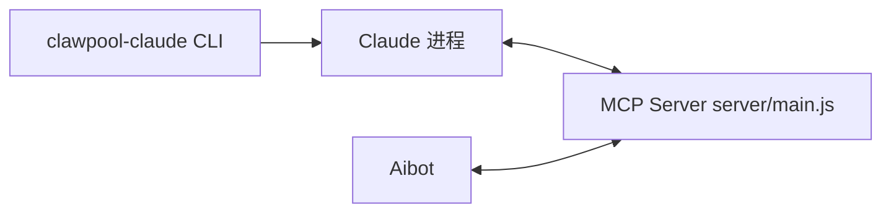
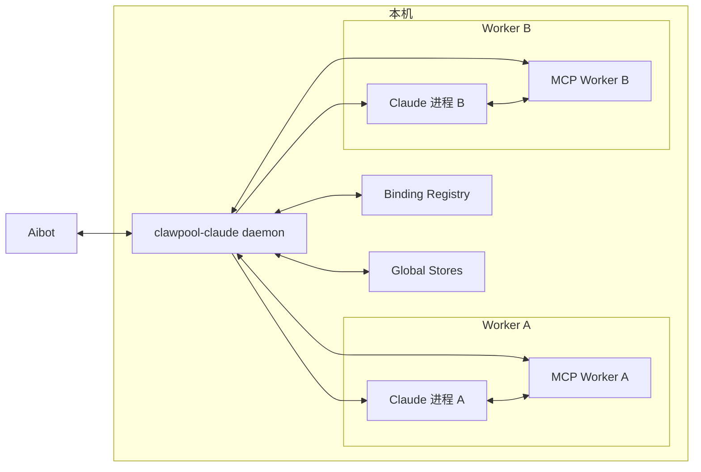
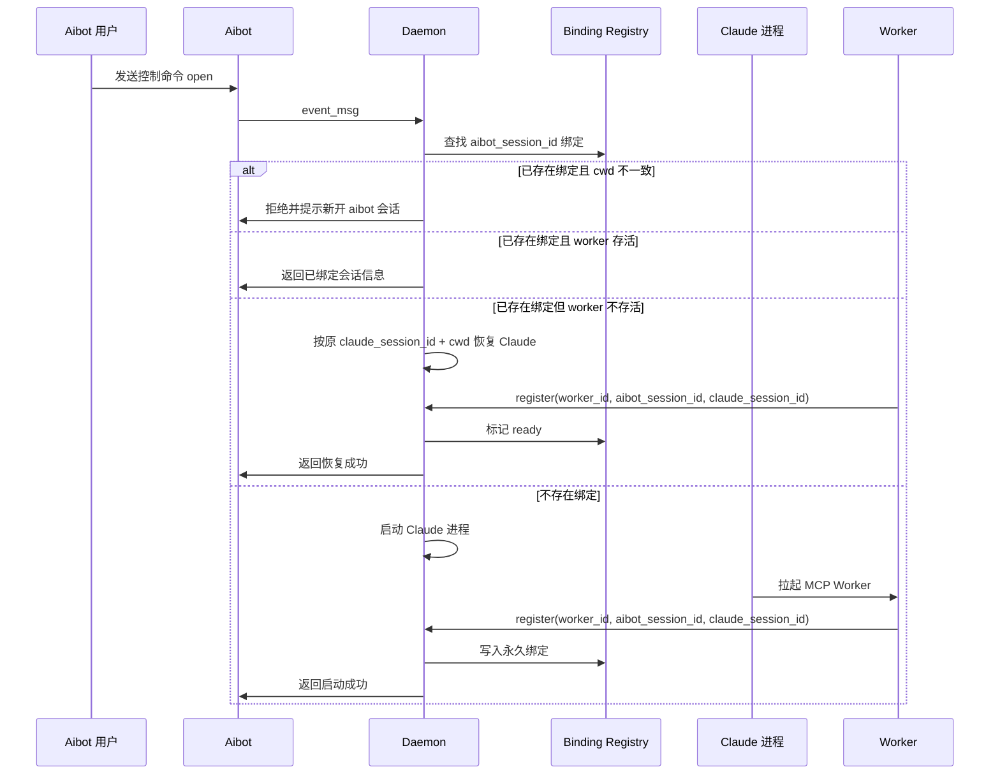
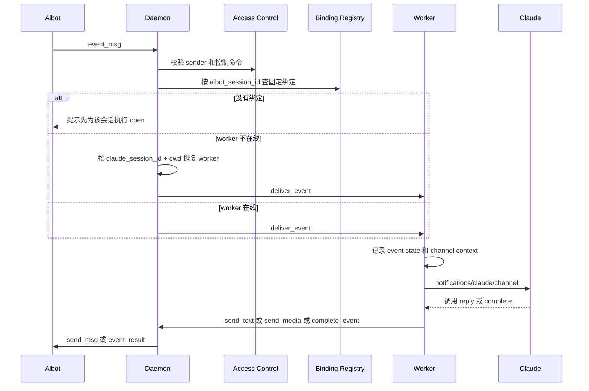
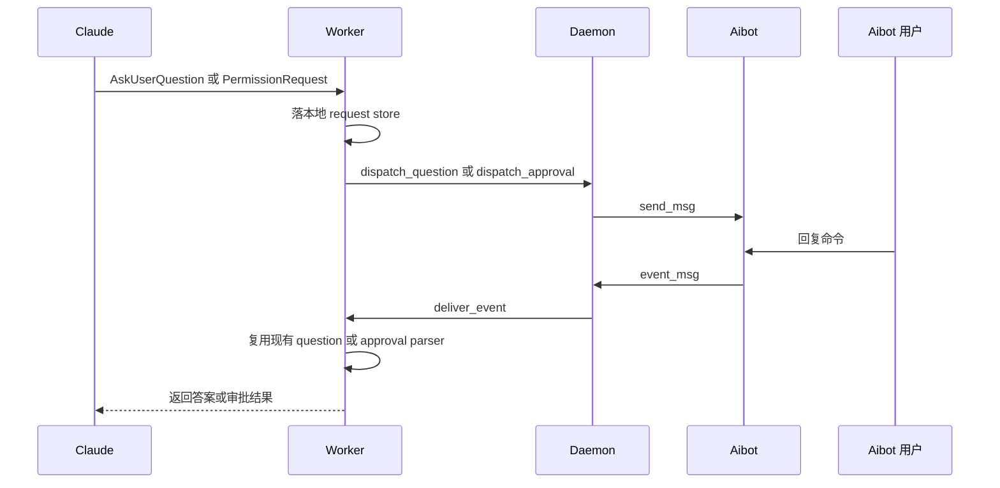

# ClawPool Claude Daemon 架构规划

## 目标

本次改造的目标不是在现有 `clawpool-claude` 命令上继续堆逻辑，而是把它拆成两层：

1. `clawpool-claude daemon`
   唯一对接 aibot，负责绑定、状态、启动、停止、恢复。
2. `clawpool-claude worker`
   由 Claude 会话加载的本地 MCP 服务，只服务一个目录下的一个 Claude 会话。

核心原则：

- 只有 daemon 直接连接 aibot。
- Claude 侧 MCP 不再直接连接 aibot，只连接 daemon。
- 普通消息走业务路由。
- 控制命令走会话绑定管理。
- 尽可能复用现有底层代码，不推翻现有消息格式、审批追问格式和 Claude 工具接口。

## 现状与问题

当前实现中，`cli/main.js` 会在当前目录直接启动 Claude；`server/main.js` 既承担 MCP Server，又直接连接 aibot websocket，还负责事件状态、审批、追问、回复发送。



这套模型的问题很集中：

- Claude 一旦启动，当前目录就定死了。
- 已启动的 Claude 直接连 aibot，外部没有总控。
- 没有一个中心状态表去管理 `(aibot session id + cwd)`。
- 想按目录新开会话、恢复指定 Claude session、停掉某个 Claude，都缺少统一入口。
- 现有本地存储是“单实例视角”，还不是“多 worker 视角”。

## 目标架构

目标是把 daemon 变成唯一入口和唯一出口，Claude worker 只做本地会话服务。



角色边界：

- daemon
  - 唯一连接 aibot websocket
  - 解析控制命令
  - 管理 binding registry
  - 启动/停止/恢复 Claude
  - 把普通消息路由到对应 worker
  - 把 worker 的回复再发回 aibot
- worker
  - 维持 Claude MCP 生命周期
  - 接收 daemon 转发过来的消息
  - 把消息投递给 Claude
  - 处理 Claude 产生的 `reply` / `delete_message` / `complete`
  - 维护该会话自己的审批、追问、事件状态

## 推荐绑定模型

建议把绑定关系收紧成一对一永久绑定：

`aibot_session_id -> claude_session_id + cwd + worker_state`

约束如下：

- 一个 `aibot_session_id` 只能绑定一个 `claude_session_id + cwd`
- 绑定一旦建立，不允许改绑到别的目录
- 绑定一旦建立，不允许改绑到别的 Claude 会话
- 普通消息永远只发往这条固定绑定
- Claude 不在线时，daemon 按记录的 `claude_session_id + cwd` 恢复原会话
- 如果用户想换目录，必须在 aibot 新开会话，而不是在老会话里切换

这套模型的好处是：

1. 普通消息不需要再做多路选择。
2. 不会发生目录串线。
3. 不会发生 Claude 会话串线。
4. daemon 的状态表和恢复逻辑会简单很多。

## 关键流程

### 1. 新开目录会话或恢复原会话



### 2. 普通聊天消息



### 3. Claude 需要审批或追问



## 与现有代码的复用建议

下面这张表是本次改造最重要的落点：哪些现有模块可以直接留，哪些只需要换宿主位置。

| 现有模块 | 当前职责 | 改造后位置 | 建议 |
| --- | --- | --- | --- |
| `cli/main.js` | 写配置并直接拉起 Claude | daemon CLI 入口 | 拆成 `daemon` 子命令和 `spawnClaudeProcess()` 帮助函数 |
| `cli/mcp.js` | 注册 Claude 用户级 MCP | daemon CLI 入口 | 保留，继续负责用户级 MCP 安装 |
| `server/aibot-client.js` | 连接 aibot websocket | daemon | 直接复用，不再给 worker 用 |
| `server/inbound-event-meta.js` | 规范化 aibot 入站事件 | daemon | 直接复用 |
| `server/access-store.js` | sender allowlist / pair / approver | daemon | 直接复用，控制面归 daemon |
| `server/config-store.js` | ws 配置和 agent 配置 | daemon | 直接复用，作为全局配置 |
| `server/agent-api-media.js` | 上传媒体并发回 aibot | daemon | 直接复用，避免 worker 直接碰 aibot |
| `server/channel-notification.js` | 构造发给 Claude 的通知 | worker | 直接复用 |
| `server/event-state.js` | 单会话 event 生命周期 | worker | 直接复用，但改成每个 worker 一份 |
| `server/event-state-persistence.js` | event 状态持久化 | worker | 直接复用，但数据目录按 worker 隔离 |
| `server/channel-context-store.js` | Claude session 与 chat 上下文映射 | worker | 直接复用，保留 cwd 维度 |
| `server/question-store.js` | 追问请求存储 | worker | 直接复用 |
| `server/approval-store.js` | 审批请求存储 | worker | 直接复用 |
| `server/question-command.js` / `approval-command.js` | 解析远端回复命令 | worker | 直接复用 |
| `server/question-text.js` / `approval-text.js` | 构造远端提示文案 | worker | 直接复用 |
| `server/result-timeout.js` | 事件超时控制 | worker | 直接复用 |
| `server/main.js` | MCP + aibot + 绑定管理混在一起 | 拆分 | 拆成 daemon main 和 worker main |

## 建议保留不变的外部契约

为了让这次改造尽量不影响 Claude 侧行为，建议保留下面这些契约：

- `<channel source="clawpool-claude" ...>` 的消息标签格式不变
- Claude 侧工具名尽量不变：
  - `reply`
  - `delete_message`
  - `complete`
  - `status`
- 远端审批和追问命令格式不变
- 现有消息拆段和 event timeout 语义不变

这样 Claude 侧提示词、hook 和大部分业务逻辑都可以复用。

## daemon 侧控制约束

daemon 对外要明确执行下面这些规则：

- 如果 `aibot_session_id` 还没有绑定，允许用 `open <cwd>` 新建会话
- 如果 `aibot_session_id` 已经绑定到某个 `cwd`，再次 `open` 其他目录时直接拒绝
- 如果 `aibot_session_id` 已经绑定，普通消息自动恢复并续发到原 Claude 会话
- 如果用户要换目录，必须在 aibot 新开会话
- daemon 不提供“老会话改绑目录”能力
- daemon 不提供“老会话改绑 Claude session”能力

## daemon 与 worker 的通信建议

daemon 和 worker 之间不要复用 aibot 协议本身，但可以复用“请求-响应 + 挂起超时”的处理模式。

建议抽一层本地 bridge：

- daemon -> worker
  - `deliver_event`
  - `worker_stop`
  - `worker_ping`
  - `sync_binding_state`
- worker -> daemon
  - `register_worker`
  - `send_text`
  - `send_media`
  - `delete_message`
  - `complete_event`
  - `dispatch_question`
  - `dispatch_approval`
  - `status_update`

传输方式建议：

- 第一版优先本地 WebSocket 或本地 HTTP + token
- 不建议让 worker 再去直接连 aibot
- 不建议让 worker 去模拟 daemon 的总控逻辑

## 建议的数据目录布局

建议把 daemon 和 worker 状态彻底拆开：

```text
~/.claude/clawpool-claude-daemon/
  daemon-config.json
  binding-registry.json
  runtime/
    workers/
      <worker-id>.json
  sessions/
    <aibot-session-id>/
      worker-meta.json
      claude-plugin-data/
        approval-requests/
        approval-notifications/
        question-requests/
        session-contexts/
        event-states/
```

说明：

- daemon 只维护全局配置和绑定表
- 每个 aibot 会话绑定有自己独立的 `CLAUDE_PLUGIN_DATA`
- worker 继续使用现有 store，但数据目录不再共享

## 推荐的模块拆分

建议优先按职责拆，不按文件大小拆：

### daemon 侧

- `server/daemon/main.js`
- `server/daemon/router.js`
- `server/daemon/binding-registry.js`
- `server/daemon/control-command.js`
- `server/daemon/worker-process.js`
- `server/daemon/worker-bridge-server.js`

### worker 侧

- `server/worker/main.js`
- `server/worker/inbound-dispatch.js`
- `server/worker/tool-outbound.js`
- `server/worker/worker-bridge-client.js`

### 共享层

- `server/shared/json-file.js`
- `server/shared/paths.js`
- `server/shared/protocol-text.js`
- `server/shared/result-timeout.js`

## 最小可落地迁移顺序

建议不要一次改完，按下面顺序落地：

### 阶段 1

先引入 daemon，但只接管 aibot websocket 和 Claude 进程启动。

结果：

- daemon 能启动和停止 Claude
- worker 先只支持一条本地桥接链路
- aibot 不再直接连 worker

### 阶段 2

把普通消息自动恢复和固定绑定投递做完。

结果：

- 已绑定 aibot 会话可自动恢复原 Claude 会话
- 普通消息按固定绑定投递

### 阶段 3

把审批、追问、状态查询迁到 daemon + worker 双层模型。

结果：

- 现有审批和追问机制恢复可用
- worker 生命周期可以被 daemon 统一管理

### 阶段 4

补 worker 回收、崩溃恢复、空闲超时、指定 Claude session 恢复。

结果：

- binding 表能长期稳定运行
- daemon 真正成为总控

## 这次改造最重要的约束

这几条建议在实现时必须守住：

1. daemon 是唯一 aibot 出入口。
2. worker 不直接碰 aibot websocket。
3. `aibot_session_id` 与 `claude_session_id + cwd` 一对一绑定，且不可改绑。
4. 每个 worker 必须有独立数据目录。
5. 现有 Claude 侧工具名和消息标签尽量不变。
6. 不要为了复用而让本地 bridge 伪装成 aibot 协议。

## 一句话结论

本次重构的本质不是“给当前命令再加几个参数”，而是把当前单体式 `server/main.js` 拆成：

- daemon：路由器 + 调度器 + aibot 网关
- worker：Claude 本地会话服务

只要守住“daemon 是唯一 aibot 出入口”这条主线，现有大部分底层逻辑都能保留下来，不需要推倒重写。

## 第一阶段实施清单

第一阶段只做一件事：先把“唯一 aibot 入口”和“Claude 子进程托管”落地，不在这一阶段把所有业务细节一次做完。

完成标准：

- daemon 能常驻运行
- daemon 能连接 aibot
- daemon 能接收 `open <cwd>` 之类的控制命令
- daemon 能为新的 `aibot_session_id` 启动一个 Claude worker
- daemon 能持久化一对一绑定关系
- daemon 能停止某个 worker
- worker 不再直接连接 aibot

### 第一步：先拆共享层

先把不带宿主语义的底层模块搬到共享目录，避免后面 daemon 和 worker 都去反向引用旧单体文件。

建议移动或复制：

- `server/json-file.js` -> `server/shared/json-file.js`
- `server/paths.js` -> `server/shared/paths.js`
- `server/protocol-text.js` -> `server/shared/protocol-text.js`
- `server/result-timeout.js` -> `server/shared/result-timeout.js`
- `server/inbound-event-meta.js` -> `server/shared/inbound-event-meta.js`

这一步完成后，要先把引用改通，并保证现有测试还能跑。

### 第二步：建立 daemon 自己的状态层

新增 daemon 专用的状态文件和存储模块：

- `server/daemon/binding-registry.js`
- `server/daemon/daemon-paths.js`
- `server/daemon/daemon-config-store.js`

`binding-registry` 第一版至少记录这些字段：

```json
{
  "schema_version": 1,
  "aibot_session_id": "chat-123",
  "claude_session_id": "uuid",
  "cwd": "/abs/path",
  "worker_id": "worker-123",
  "worker_status": "starting|ready|stopped|failed",
  "plugin_data_dir": "/abs/path",
  "created_at": 0,
  "updated_at": 0,
  "last_started_at": 0,
  "last_stopped_at": 0
}
```

这一层先不要做复杂索引，只需要支持：

- `getByAibotSessionID`
- `createBinding`
- `markWorkerStarting`
- `markWorkerReady`
- `markWorkerStopped`
- `markWorkerFailed`

### 第三步：抽 Claude 子进程管理

把 `cli/main.js` 里“直接前台拉起 Claude”的逻辑抽成可复用进程管理函数。

建议新增：

- `server/daemon/worker-process.js`

这个模块先只管：

- `spawnWorker({ aibotSessionID, cwd, pluginDataDir, claudeSessionID? })`
- `stopWorker(workerID)`
- `getWorkerRuntime(workerID)`

它内部做的事：

- 生成或接收 `claude_session_id`
- 为该 worker 生成独立 `CLAUDE_PLUGIN_DATA`
- 用指定 `cwd` 启动 Claude
- 把 worker 需要的环境变量传进去
- 记录 pid、stdout/stderr、退出码

这里要特别注意：

- 第一阶段就不要再用当前 shell 前台继承 `stdio: "inherit"` 了
- daemon 要自己托管子进程
- worker 的日志要能落到独立文件

### 第四步：先定义 daemon 和 worker 的本地桥接协议

先把本地桥接协议固定下来，再写服务端和客户端，避免两边边写边变。

建议先收敛到最小命令集：

- daemon -> worker
  - `deliver_event`
  - `worker_stop`
- worker -> daemon
  - `register_worker`
  - `send_text`
  - `send_media`
  - `delete_message`
  - `complete_event`
  - `status_update`

建议新增：

- `server/daemon/worker-bridge-server.js`
- `server/worker/worker-bridge-client.js`
- `server/shared/bridge-schema.js`

第一阶段不要求桥接足够通用，只要求：

- 有鉴权
- 有请求 id
- 有超时
- 有错误码

### 第五步：把 aibot websocket 收归 daemon

这一步是关键分界线。完成后，worker 侧就不能再直接 new `AibotClient()`。

建议新增：

- `server/daemon/main.js`
- `server/daemon/router.js`

这里直接复用：

- `server/aibot-client.js`
- `server/access-store.js`
- `server/config-store.js`
- `server/agent-api-media.js`

daemon 在这一阶段需要做到：

- 启动时加载配置和 binding registry
- 连接 aibot websocket
- 收到消息后先判断是否为控制命令
- 如果是 `open <cwd>`，为当前 `aibot_session_id` 建绑定并启动 worker
- 如果是普通消息，但当前会话还没绑定，直接提示先 open
- 如果是普通消息，且已经绑定，先尝试恢复 worker，再投递给 worker

### 第六步：把 worker 从旧单体里剥出来

worker 第一阶段只保留“Claude 本地交互”和“把 Claude 输出交回 daemon”。

建议新增：

- `server/worker/main.js`
- `server/worker/inbound-dispatch.js`
- `server/worker/tool-outbound.js`

这一层可以直接复用旧代码里的这些逻辑：

- `channel-notification.js`
- `event-state.js`
- `event-state-persistence.js`
- `channel-context-store.js`
- `question-store.js`
- `approval-store.js`
- `question-command.js`
- `approval-command.js`
- `question-text.js`
- `approval-text.js`

但要改掉的点也很明确：

- worker 不再持有 `AibotClient`
- worker 的 `reply/delete_message/complete` 不再直接发 aibot
- worker 改为通过 bridge 交给 daemon

### 第七步：控制命令先做最小集

第一阶段不要一下做很多命令，先做这 4 个就够了：

- `open <cwd>`
- `status`
- `stop`
- `where`

建议新增：

- `server/daemon/control-command.js`

约束：

- `open <cwd>`：只有当前 `aibot_session_id` 没绑定时允许执行
- `status`：返回当前绑定、worker 状态、Claude session id、cwd
- `stop`：只停止当前会话绑定的 worker，不删绑定
- `where`：告诉用户当前会话绑的是哪个目录

### 第八步：明确旧代码如何退场

第一阶段结束时，旧的 `server/main.js` 不要立刻删除，但要明确进入退役状态。

建议：

- 保留旧 `server/main.js` 作为兼容入口，直到 daemon + worker 跑稳
- 新增 `server/worker/main.js` 后，Claude 用户级 MCP 改为指向 worker 入口
- 新增 `clawpool-claude daemon` 子命令
- 原 `clawpool-claude` 默认行为改成启动 daemon，而不是直接启动 Claude

### 第九步：第一阶段验证清单

这一步不是“代码写完就算完”，必须真跑通。

最低验证项：

1. 启动 daemon 后，能成功连上 aibot。
2. 在一个新的 aibot 会话里发送 `open /some/path`，daemon 能启动一个 Claude worker。
3. 同一 aibot 会话再发普通消息，daemon 能把消息投到刚才那个 worker。
4. 杀掉 Claude 进程后，再发普通消息，daemon 能按原绑定恢复 worker。
5. 同一 aibot 会话尝试 `open /other/path`，daemon 会拒绝。
6. 新开一个 aibot 会话，再 `open /other/path`，daemon 能创建另一条新绑定。
7. `stop` 后再发消息，daemon 能重新拉起原会话。

### 第十步：第一阶段交付边界

第一阶段明确不做：

- 一个 aibot 会话绑定多个目录
- 老会话改绑目录
- 老会话改绑 Claude session
- worker 空闲自动回收
- 多种控制命令语法
- 完整审批和追问链路迁移

第一阶段只要把“daemon 托管 + 固定绑定 + 自动恢复”跑通，就是合格交付。
